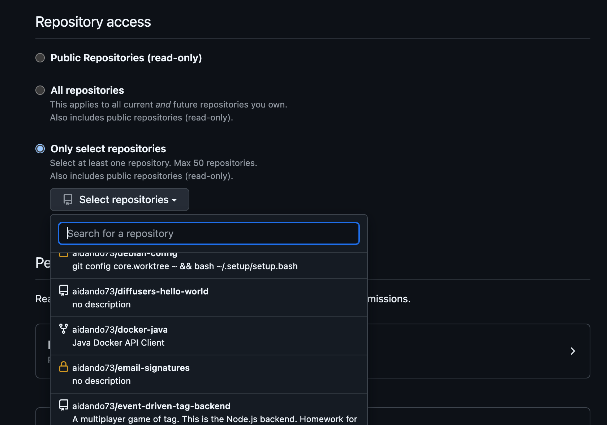
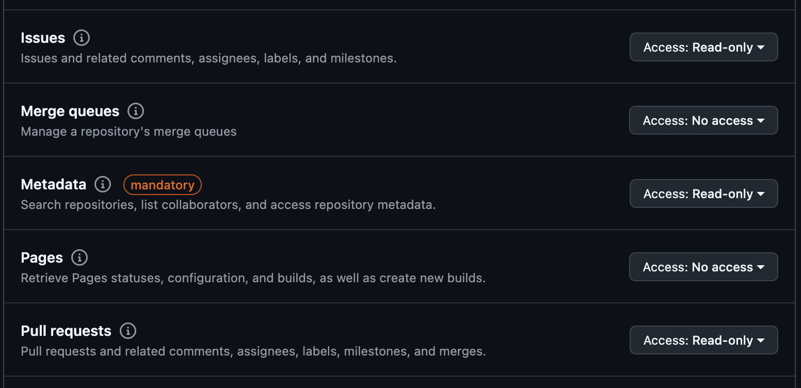

# Llama Stack Apps Coding Agent

- Go to https://github.com/settings/personal-access-tokens/new
  - Fill in name
  - Select the repositories you want it to have access to

- Add TODO permissions
- Note that the agent will not be able to close/merge PRs or issues - it will only read from the issue and create a PR




Copy the .env.example file to .env

```bash
cp .env.example .env
```

- Add your github token to the .env file

```bash
GITHUB_TOKEN=github_pat_11SDF...
```

- This only supports 3.3 70B model at the moment

Run a llama-stack distribution, we use fireworks in this example, but you can use any other distribution that supports the 3.3 70B model:
```bash
# Run a llama-stack distribution
export LLAMA_STACK_PORT=5000
# You can get an api key from https://fireworks.ai/account/api-keys
export FIREWORKS_API_KEY=__your_fireworks_api_key_here__
docker run -it \
  -p $LLAMA_STACK_PORT:$LLAMA_STACK_PORT \
  -v ~/.llama:/root/.llama \
  llamastack/distribution-fireworks \
  --port $LLAMA_STACK_PORT \
  --env FIREWORKS_API_KEY=$FIREWORKS_API_KEY
```

- Run the agent, giving it the issue number or url you want solved (ensuring that the api key has access to that repo)

```bash
python3 agent.py \
--issue https://github.com/aidando73/bitbucket-syntax-highlighting/issues/67
```

- The agent will create a PR with the changes it has made
- If the agent fails to create a PR, it will create a comment on the issue with the reasoning trace.